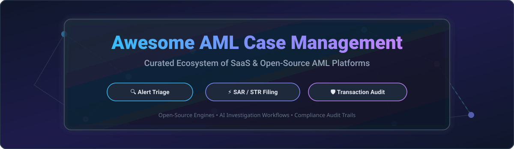

# 🛡️ Awesome AML Case Management & Financial Crime Investigation Ecosystem 🔍

> A curated directory of enterprise **SaaS AML Case Management platforms** and self-hosted **Open-Source Anti-Money Laundering (AML) software**, specialized for alert triage, transaction monitoring, financial crime investigations, Suspicious Activity Report (SAR / STR) filings, and regulatory compliance audit trails.

---

## 📑 Table of Contents
- [📊 Market Overview & Industry Analysis](#-market-overview--industry-analysis)
- [🏢 Enterprise SaaS / Hosted AML Case Management Platforms](#-enterprise-saas--hosted-aml-case-management-platforms)
- [💻 Open-Source AML GitHub Projects](#-open-source-aml-github-projects)
- [🧩 Architectural Blueprints & Stack Guidance](#-architectural-blueprints--stack-guidance)
- [🤝 How to Contribute](#-how-to-contribute)
- [☕ Support & Sponsorship](#-support--sponsorship)
- [📈 Star History](#-star-history)
- [⚠️ Disclaimer](#%EF%B8%8F-disclaimer)

---

## 📊 Market Overview & Industry Analysis

> **Global Market Size & Growth:** The Anti-Money Laundering (AML) software market is estimated at **$3.8 Billion to $4.2 Billion in 2026** and is projected to reach **$8.5+ Billion by 2031**, growing at a CAGR of ~15.8%.  
> **Market Structure:** The market is **moderately fragmented**, featuring established enterprise legacy suites (NICE Actimize, Oracle, FICO, SAS, Fenergo) serving tier-1 global banks, alongside high-growth venture-backed RegTech unicorns (Feedzai, Unit21, ComplyAdvantage, Flagright, AMLYZE) capturing fintechs, neobanks, and mid-market institutions.

---

## 🏢 Enterprise SaaS / Hosted AML Case Management Platforms

Below is a detailed pricing, free trial, and company scale breakdown of top commercial AML case management solutions:

| 🏢 Platform | 💰 Starting Tier Price | 🎁 Free Tier / Free Trial Limits | 📊 Company Scale (Revenue / Valuation) | 📌 Core Capabilities |
| :--- | :--- | :--- | :--- | :--- |
| **[Oracle FCCM](https://www.oracle.com/)** | **$350,000 / year** (Enterprise license starting tier) | 30-day Free Trial with $300 Oracle Cloud credits | **~$53.8 Billion** Annual Revenue | Financial Crime & Compliance Management suite, enterprise SAR filing, institutional audit trail. |
| **[NICE Actimize](https://www.niceactimize.com/)** | **$250,000 / year** (Enterprise core platform base) | No free tier; 14-day guided proof-of-concept for qualified institutions | **~$2.4 Billion** Annual Revenue (NICE Group) | Market-leading alert triage, AI-driven entity resolution, automated SAR filing workflows. |
| **[SAS AML](https://www.sas.com/)** | **$180,000 / year** (Base financial crime suite) | 14-day Free Trial (SAS Viya Hosted Environment) | **~$3.2 Billion** Annual Revenue | Advanced analytics, behavioral anomaly detection, regulatory investigation workflows. |
| **[FICO TONBELLER](https://www.fico.com/)** | **$120,000 / year** (Standard compliance module) | No free tier; 30-day sandbox trial for institutional partners | **~$1.6 Billion** Annual Revenue | Sentry-based AML compliance, risk scoring, alert management, and regulatory reporting. |
| **[Fenergo](https://www.fenergo.com/)** | **$100,000 / year** (Base Client Lifecycle Management module) | No free tier; custom 30-day proof-of-concept environment | **~$1.15 Billion** Valuation | Client Lifecycle Management (CLM), regulatory onboarding, institutional case management. |
| **[Feedzai](https://feedzai.com/)** | **$60,000 / year** (Growth platform package) | No free tier; 14-day sandbox access for enterprise demos | **~$1.0 Billion+** Valuation (Unicorn) | AI-first transaction monitoring, risk scoring, alert prioritization, and fraud/AML fusion case management. |
| **[Unit21](https://www.unit21.ai/)** | **$48,000 / year** ($4,000/month billed annually) | No free tier; 14-day trial sandbox available on request | **~$300 Million** Valuation | No-code rule engine, automated SAR/CTR filing, customizable investigator workflows. |
| **[ComplyAdvantage Case Manager](https://complyadvantage.com/)** | **$18,000 / year** ($1,500/month starting tier) | No free tier; 7-day free API search trial | **~$70 Million** Annual Revenue / ~$400M Valuation | Real-time sanctions screening, PEP checks, investigation documentation, and alert manager. |
| **[Flagright](https://www.flagright.com/)** | **$11,988 / year** ($999/month starting plan) | 14-day Free Trial (up to 10,000 test transactions) | **~$5 Million** ARR / ~$30M Valuation | AI-native AML infrastructure, real-time transaction monitoring, and case management for fintechs. |
| **[AMLYZE](https://amlyze.com/)** | **$6,000 / year** (€500/month starter tier) | 14-day Free Trial with access to full sandbox environment | **~$2 Million** ARR / ~$15M Valuation | Core AML compliance, transaction monitoring, screening, and case management for EMIs and neobanks. |

---

## 💻 Open-Source AML GitHub Projects

Open-source AML tools allow fintechs, banks, and RegTech engineers to build self-hosted case management systems with full data privacy, transparent audit trails, and zero vendor lock-in.

The table below is sorted by **GitHub Stars_Count (descending)**:

| 📦 Project | ⭐ GitHub_Stars | 📜 License | 🧰 Tech Stack | 📌 Description |
| :--- | :--- | :--- | :--- | :--- |
| **[Ballerine](https://github.com/ballerine-io/ballerine)** |  | Apache-2.0 | TypeScript, React, Node.js | Open-source infrastructure for identity and risk management with a case management dashboard for manual user approvals and KYC/KYB reviews. |
| **[OpenCTI](https://github.com/OpenCTI-Platform/opencti)** |  | Apache-2.0 | TypeScript, GraphQL, Python | Open-source cybersecurity & financial threat intelligence platform widely adapted for complex AML case management, entity linking, and fraud investigation graphs. |
| **[TheHive](https://github.com/StrangeBee-Corp/TheHive)** |  | AGPL-3.0 | Scala, Play Framework, AngularJS | Scalable 4-in-1 open-source security incident & financial case management platform designed for rapid alert triage, evidence collection, and collaboration. |
| **[Tazama](https://github.com/tazama-lf)** |  | Apache-2.0 | TypeScript, NodeJS, K8s | Open-source real-time transaction monitoring platform for fraud and money laundering, hosted by Linux Foundation & Gates Foundation. Integrates with external case management systems. |
| **[Marble](https://github.com/checkmarble/marble)** |  | ELv2 | Go, TypeScript, React | Real-time decision engine for fraud and AML with an integrated case manager, customizable risk rules, audit trails, and automated escalations. |
| **[Argus Investigator](https://github.com/Cesco556/argus-investigator)** |  | MIT | Next.js 16, Claude AI, Sigma.js | AI-powered AML investigator workspace featuring Model Context Protocol (MCP) tools, network graph visualizations, SAR clock triage, and defensible decision logging. |
| **[AML Transaction Monitoring Engine](https://github.com/Cesco556/aml-transaction-monitoring-engine)** |  | MIT | Python, FastAPI, Redis Streams | Production-ready AML engine with ML anomaly detection, sanctions screening, investigation workflows, and FinCEN BSA E-Filing SAR generation. |
| **[Jube](https://github.com/jube-home/aml-fraud-transaction-monitoring)** |  | AGPL-3.0 | C# (.NET Core), React | Open-source AML and fraud detection platform with transaction monitoring, rule engine, sanctions screening, and built-in case management. |
| **[ThreatLens](https://github.com/innovatewithkishlay/ThreatLens)** |  | MIT | Python, JavaScript, D3.js | AI-powered financial crime visualization platform mapping multi-account money laundering flows, shared IPs, phone numbers, and transactional links. |
| **[Clarium](https://github.com/QuantSingularity/Clarium)** |  | MIT | FastAPI, Python, React | RegTech module featuring a hash-chained tamper-evident audit trail, AML transaction monitoring rules, and RESTful case review endpoints (`PATCH /aml/review/{id}`). |
| **[Nexus AML Compliance](https://packagist.org/packages/azaharizaman/nexus-aml-compliance)** |  | MIT | PHP 8.3+ | Framework-agnostic PHP package for AML risk scoring (0-100), suspicious activity pattern monitoring, and automated SAR file output. |
| **[FMS (Fraud Monitoring System)](https://www.linkedin.com/posts/tochukwu-iloani-166259100_aml-regtech-frauddetection-activity-7484713507054346240-ZRel)** |  | MIT | Python, Django | Risk-based transaction monitoring system featuring customer risk profiling, OFAC screening, CTR/SAR investigator workflows, and audit logging. |
| **[Graphomaly](https://pypi.org/project/graphomaly/)** |  | BSD-3-Clause | Python, Scikit-Learn | Graph machine learning package built for detecting abnormal transaction patterns and money laundering structures in financial networks. |

---

## 🧩 Architectural Blueprints & Stack Guidance

For institutions building custom, self-hosted AML compliance architectures:
- **Alert Triage & Case UI:** Combine **Ballerine** or **Argus Investigator** for modern web-based investigation desktops.
- **Rules Engine & Detection:** Use **Marble** or **Jube** for high-throughput rule execution and transaction evaluation.
- **Large-Scale Transaction Monitoring:** Deploy **Tazama** (Linux Foundation) for ISO 20022 messaging and real-time transaction scoring.
- **Network Analysis & Link Analysis:** Integrate **ThreatLens** or **Graphomaly** for visual graph mapping of shell company rings and fund flows.
- **SAR Generation & Cryptographic Audit:** Implement **AML Transaction Monitoring Engine** or **Clarium** for FinCEN BSA e-filing and SHA-256 hash-chained audit compliance.

---

## 🤝 How to Contribute

Contributions are warmly welcomed! To add a new enterprise SaaS platform or open-source GitHub project:

1. 🍴 Fork this repository.
2. 📝 Add your item to `README.md` following the existing tabular structure.
3. 🔎 Ensure all vendor pricing, free trial limits, or GitHub Stars_Badges are accurately linked and documented.
4. 🚀 Open a Pull Request with a short summary of the addition.

---

## ☕ Support & Sponsorship

If you find this AML Case Management directory helpful for your research, enterprise evaluation, or open-source stack design:

- ⭐ **Star this repository** to stay updated with new RegTech projects.
- 🔀 **Fork & Share** with your financial crime, compliance, and engineering teams.
- 💖 **Sponsor the Maintainer**: Support ongoing curation and open-source RegTech tooling via [GitHub Sponsors](https://github.com/sponsors/ishandutta2007).

---

## 📈 Star History

---

## ⚠️ Disclaimer

- This list is **community-curated** for informational and educational purposes only — it does not constitute legal or regulatory advice.
- AML case management software handles confidential customer data (PII) and financial records. Ensure all deployments comply with BSA/AML, FinCEN, EU AMLD, OFAC sanctions, and local regulatory requirements.
